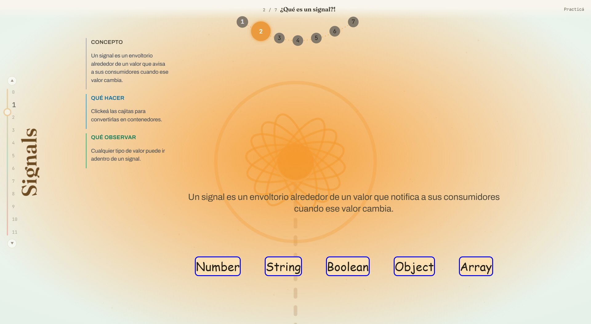

# Angular Signals — Interactive Introduction

An interactive playground for learning **Angular Signals** from the ground up.
Instead of reading about reactivity, you *watch it happen*: every concept is a
small, self-contained screen where you can click, type and toggle to see how
signals, `computed`, `effect` and change detection actually behave.



The default entry (`/`) is the **integrated view**: a "reactive molecule" tour
where each of the 12 concepts is an atom. Scroll to dive into an atom and its
sub-levels orbit the card, each one embedding the *real* demo component of that
lesson. Deep-links are shareable: `?nivel=1&sub-nivel=2` reopens exactly where
you were.

Built with **Angular 22** (standalone components, `OnPush` everywhere, signal-first
APIs) and styled with **Tailwind CSS**.

## Why this exists

Signals are the biggest shift in Angular's reactivity model in years. This repo
turns the official mental model into a guided, hands-on tour — useful both as a
self-teaching resource and as a live demo for talks and workshops.

## Learning path

The content is organized as progressive **levels**, each with focused sub-levels:

| Level | Topic | What you explore |
| ----- | ----- | ---------------- |
| **0** | Introduction | How Angular renders the DOM tree, classic change detection vs. signal-based change detection, HTML-to-tree visualization |
| **1** | Interacting with signals | Writable signals, `set` vs. `update`, read-only signals, the different kinds of signals |
| **2** | Computed signals | Derived state, dynamic dependencies, lazy evaluation & memoization |
| **3** | Effects | `effect()`, cleanup, manual destruction, what happens when a component is destroyed |
| **4** | Equality functions | Custom equality and when a signal *doesn't* notify its consumers |
| **5** | `linkedSignal` | Writable state derived from a source: reset on change, or preserve if still valid |
| **6** | `resource` / `rxResource` | Async signals — `value`/`status`/`error`/`isLoading` with a Promise or an RxJS stream |
| **7** | `input` · `model` · `output` | Signal-based component APIs: `input()`/`output()`, two-way `model()`, `input.required()` and `transform` |
| **8** | Queries & interop | `viewChild()`/`viewChildren()` and `contentChild()`/`contentChildren()` as signals, `toSignal()`/`toObservable()`, `untracked()` |
| **9** | `afterRenderEffect` & `onCleanup` | Reading/measuring the DOM after render, and cleaning up effects without leaks |
| **10** | Debounced signals | A debounced value, two ways: RxJS (`debounceTime`) and by hand (`effect` + `onCleanup`) |
| **11** | Capstone: zoneless | Why signals + OnPush let Angular drop Zone.js (`provideZonelessChangeDetection()`) |

### Signals Lab 🧪

Beyond the levels there's a **Lab** (`/lab`) — a "workbench" of small instruments
(signal flow, an effect *oscilloscope*, reactive cells for `computed`, and a manual
playground) to experiment freely.

## Getting started

```bash
# 1. Install dependencies
npm install

# 2. Start the dev server (http://localhost:4200)
npm start
```

> **Requirements:** Node.js 20.19+ / 22.12+ (as required by Angular 22) and a
> Chromium-based browser for running the unit tests.

## Available scripts

| Script | Description |
| ------ | ----------- |
| `npm start` | Dev server with HMR at `http://localhost:4200` |
| `npm run build` | Production build into `dist/angular-examples` |
| `npm run watch` | Rebuild on change (development configuration) |
| `npm test` | Unit tests (Karma + Jasmine) |
| `npm run lint` | Lint with ESLint + `angular-eslint` |
| `npm run format` | Format `src/` with Prettier |
| `npm run format:check` | Check formatting without writing |

## Tech stack

- **[Angular 22](https://angular.dev)** — standalone components, signals, `@if`/`@for` control flow
- **[`@angular/build`](https://angular.dev/tools/cli/build)** — esbuild/Vite-based toolchain
- **[Tailwind CSS](https://tailwindcss.com)** — utility-first styling
- **[ngx-echarts](https://github.com/xieziyu/ngx-echarts)** — charts used by some visualizations
- **ESLint + angular-eslint** — linting and Angular best-practice rules

## Project structure

```
src/app/
├── integrada-vista/  # The default entry (/): the "reactive molecule" tour of the 12 concepts
├── signals/          # The learning levels (0–11) and their sub-levels
├── practice/         # Applied examples that use what you learned (/practica/*)
├── lab/              # Signals Lab: bench-frame, hub and instruments
├── components/       # Feature components (sidebar menu, histories, trees…)
├── components-atom/  # Atomic UI building blocks (button, code, input, title…)
├── components-draw/  # Drawing/visualization components (variable boxes, node tree)
├── layouts/          # Reusable page layouts (two-column, column + code)
├── libs/             # Framework-agnostic helpers (e.g. the HTML code parser)
├── interfaces/       # Shared TypeScript types
└── app.routes.ts     # Route tree that powers the leveled navigation
```

### Conventions

- **Change detection:** every component uses `ChangeDetectionStrategy.OnPush`.
  State that drives the view is held in **signals**; the few cases that aren't
  (e.g. router-event-driven menu state) explicitly call `markForCheck()`.
- **Standalone components** with explicit `imports` — no `NgModule`s.

## Non-goals

This is a **teaching playground**, not a library:

- It is **not** a reusable component or state library to `npm install`. The demos are meant to be read and run, not consumed as a dependency.
- It does **not** try to cover all of Angular, only the **signals** surface (reactivity, `computed`, `effect`, `resource`, zoneless).
- The integrated "molecule" view is a visual explainer, not a production UI pattern to copy verbatim.

## License

Released under the [MIT License](./LICENSE).
